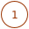
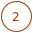
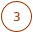
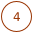

#Design Model User Guide

Design Models help to model a software architecture with Patterns.
The existing Patterns in the Pattern Atlas can be used in a Design Model.
Additionally implementations for Patterns, so called Concrete Solutions, can be defined.
Finally these Concrete Solutions of a Design Model can be automatically aggregated to a source code skeleton, expressing the modelled software architecture.

##Introduction

This section provides a brief introduction to users of Pattern Atlas.
It will describe how to manage Design Models, the modelling with Patterns, the selection of a Concrete Solution and the aggregation to a source code skeleton.

##Management

Create a new Design Model or select an existing Design Model to open it in the editor.

 Choose Design Models in the menu.

 Add a new Design Model or

 Select an existing one.

{: style="height: 450px; margin-bottom:10px"}
   

##Modelling
Model a software architecture with Patterns.

 Open a Pattern Language and add a Pattern with drag and drop to the modelling canvas.

 Patterns can be moved around and have four dots in the middle of each border, to add relationships to other Patterns.

 Show possible Concrete Solutions for each Pattern in the Design Model.

{: style="height: 300px; margin-bottom:10px"}

##Concrete Solutions

 A software architecture modelled with Patterns and their relationship.

 Possible Concrete Solutions for the Patterns, the preferred one can be selected individually for each Pattern with a simple click.

 Globally select the preferred Concrete Solutions, e.g. with ``cs.name.indexOf('sync') !== -1`` to exclude the synchronous JMS implementations.

 Aggregate the selected Concrete Solutions. Pattern Atlas will serve a download with the source code result.

Select Concrete Solutions for a Design Model and aggregate them to a software skeleton representing the software architecture. 

{: style=" margin-bottom:10px"}

