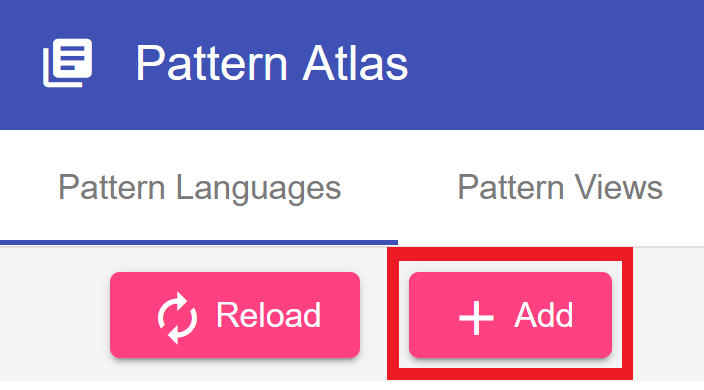
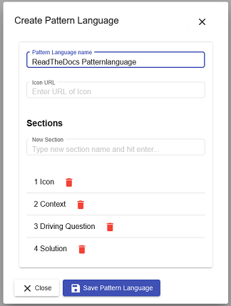
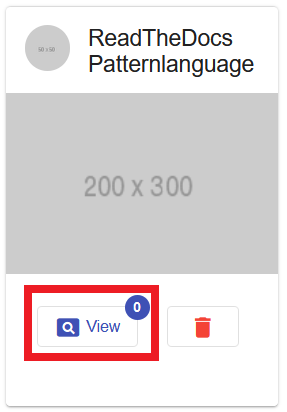
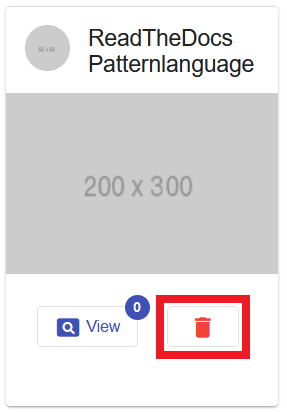

#Pattern Languages

A Pattern Language consists of a set of uniformly structured [patterns](../user_guide/patterns.md) of the same domain that are related to each other.

##Create a Pattern Language
To add a new Pattern Language and define its format:

1. Click the *Add* button while being in the Pattern Languages Tab.

    {: style="height:150px; margin-bottom:30px"}

2. Set the Pattern Language's name and optionally add the URL for an icon. 
   Remove unwanted sections from the preset and add custom sections in the preferred order to the list. 
   Finally, save the Pattern Language.

    !!! info
        The format can NOT be changed later on, so make sure the section order is correct, and it does not contain any unwanted sections or other errors.
   
    
   
##View & Access a Pattern Language
To View a Pattern Language and add content to it click the *View* button.
{: style="height:300px; margin-bottom:10px"}

##Delete a Pattern Language

To delete a Pattern Language click the *Delete* button.

!!! info
    The Pattern Language must be empty. This means that a Pattern Language can not be deleted while it contains any Patterns.

{: style="height:300px; margin-bottom:30px"}
