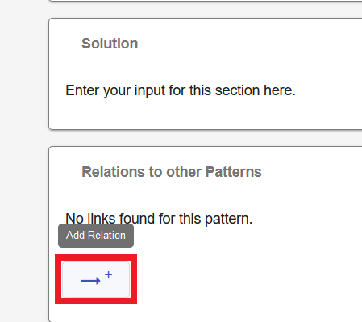
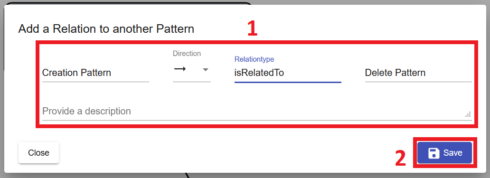
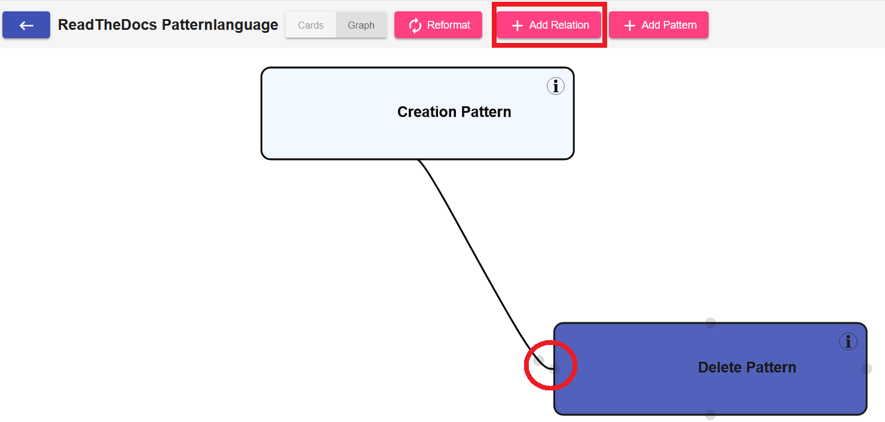
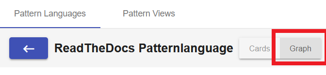
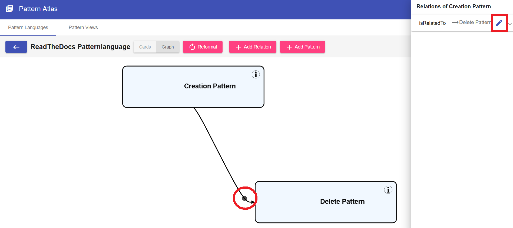
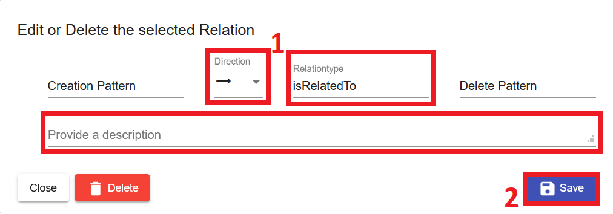
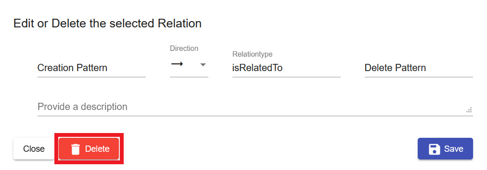

#Pattern Relations

Relations are used to link two different Patterns. The following attributes get used to specify the Relation:

* **Direction**: A relation between 2 Patterns can be directional or undirectional.
* **Relationtype**: A relation has a type. Selectable types are for example: isRelatedTo, isUsedBefore, isUsedAfter, dependsOn, isAlternativeOf, and many more. Custom type inputs are also possible.
* **Description**: The description contains further information about the relation.

##Add a Relation
To add a relation to a Pattern either

1. Select the Pattern. 
2. Scroll down to *Relations to other Patterns* and click the *Add Relation* symbol.
   {: style="height:200px; margin-bottom:30px"}
3. Fill out the form and save it.

{: style="margin-bottom:30px"}

**OR**

1. Navigate to the [Pattern Graph](../user_guide/pattern-graph.md) and click *Add Relation*, or
   
    1.1. Hover over a Pattern
   
    1.2 Drag & Drop the grey circle onto another Pattern to create a relation between them.
    {: style="margin-bottom:30px"}
   
2. Fill out the form and save it.

{: style="margin-bottom:30px"}

##Edit a Relation
To Edit an existing relation

1. Navigate to the Pattern Graph
   
    {: style="width:400px; margin-bottom:30px"}

2.1 Select one of the Patterns that is part of the relation and click the *Edit* icon in the side menu.

2.2 Click the grey circle on the line that is representing the relation that you want to edit.
    {: style="margin-bottom:30px"}

3\. Edit the Direction, Relationtype or Description and then save the Pattern to confirm your changes.
   {: style="margin-bottom:30px"}

##Delete a Relation
To Delete an existing relation

1. Navigate to the Pattern Graph

   {: style="width:400px; margin-bottom:30px"}

2.1 Select one of the Patterns that is part of the relation and click the *Edit* icon in the side menu.

2.2 Click the grey circle on the line that is representing the relation that you want to edit.
{: style="margin-bottom:30px"}

3. Press the delete button to remove the relation.
   {: style="margin-bottom:30px"}
