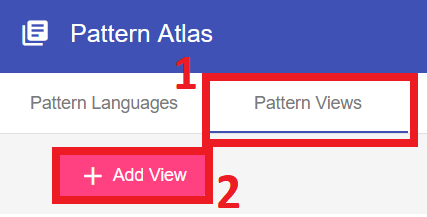
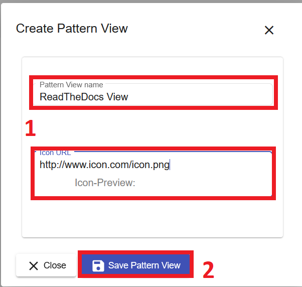
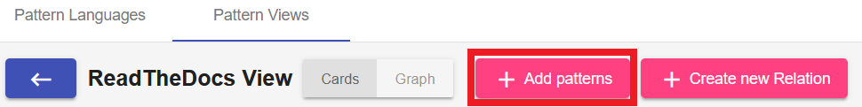
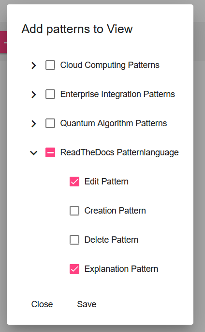
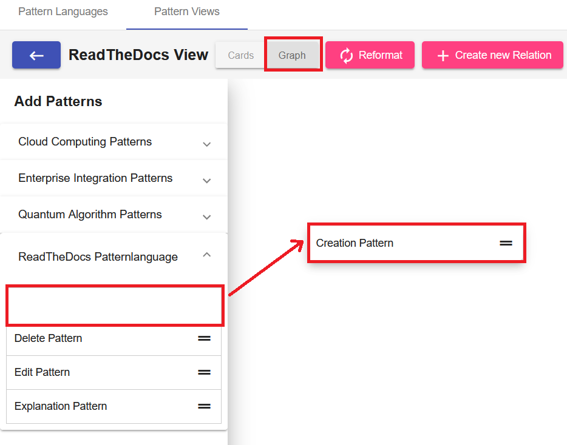

#Pattern Views

Pattern Views enable cross Pattern Language relations. A Pattern View can contain subsets of Patterns from multiple Pattern Languages.
A Pattern View has its own [Pattern Graph](../user_guide/pattern-graph.md) and [Pattern Relations](../user_guide/pattern-relations.md)
A detailed introduction to Pattern Views can be found [here](https://link.springer.com/chapter/10.1007/978-3-030-64846-6_6).

##Create Pattern View
1. To create a Pattern View select the *Pattern Views* tab and click *Add View*.
   
    {: style="height:150px; margin-bottom:30px"}

2. Fill out the Form and click on *Save*
   
    {: style="height:350px; margin-bottom:10px"}
   
##Add Patterns to View
1. To add Patterns to the View click on *Add Patterns*
   
    {: style="margin-bottom:30px"}

2. Select the required Patterns from the different Pattern Languages. It is possible to import all Patterns of a Pattern Language or just single Patterns.
   
    {: style="height: 400px; margin-bottom:30px"}

**OR**

1. Navigate to the Pattern View's Pattern Graph and use the side menu to drag & drop Patterns into the graph.

    {: style=" margin-bottom:30px"}

##Pattern Relations for Pattern Views
Pattern Views make it possible to relate Patterns from different Pattern Languages. The process of adding, editing and removing Relations is explained [here](../user_guide/pattern-relations.md).

##Pattern Graph for Pattern Views
The functionalities of the Pattern Graph are explained [here](../user_guide/pattern-graph.md)