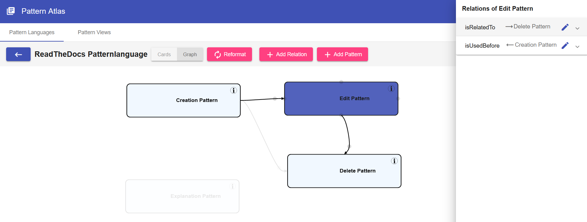

#Pattern Graph

The Pattern Graph displays all the [Patterns](../user_guide/patterns.md) of a [Pattern Language](../user_guide/pattern-languages.md) or a [PatternView](../user_guide/pattern-views.md)

The Pattern Graph supports the following operations:

* [Relations](../user_guide/pattern-relations.md) can be added by hovering the source pattern and dragging the grey circle onto the target pattern.
* [Relations](../user_guide/pattern-relations.md) can be deleted by clicking the grey circle on a relation.
* The Layout of the graph can be edited by moving the Patterns via Drag & Drop or by clicking *Reformat*
* Selecting a Pattern shows the Patterns relations
* Clicking the Info-Button navigates to the *Detail View* of a Pattern where the content of the Pattern can be seen.

