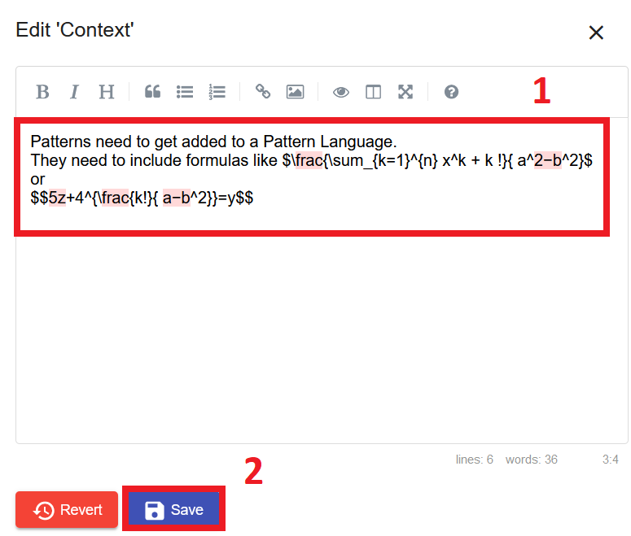

#Patterns

A pattern  is  a  structured  document  containing  an  abstract description of a proven solution of a recurring problem.
Furthermore, a pattern points to other patterns that may jointly contribute to an encompassing solution of a complex problem. 
This way, a network of related patterns, i.e. a [pattern language](../user_guide/pattern-languages.md)
, results [[1](https://www.iaas.uni-stuttgart.de/publications/INPROC-2019-05-Towards_a_Pattern_Language_for_Quantum_Algorithms.pdf){:target="_blank"}].

!!! info
    The content of a Pattern gets displayed in **Markdown**. 
    For more information about the Markdown-Syntax check out the [Markdown-Cheatsheet](https://github.com/adam-p/markdown-here/wiki/Markdown-Cheatsheet)

!!! info
    Pattern Atlas supports the input of **TeX-formulas**. 
    Inline Maths can be rendered by adding a single ``$`` on each side of the TeX code.  Block rendering can be added by surrounding the TeX with two ``$$``.
    Anything between two $ characters will be treated as TeX math. The opening $ must
    have a non-space character immediately to its right, while the closing $ must
    have a non-space character immediately to its left, and must not be followed
    immediately by a digit. Thus, $20,000 and $30,000 won’t parse as math. If for some
    reason you need to enclose text in literal $ characters, backslash-escape them and
    they won’t be treated as math delimiters. [2](https://github.com/waylonflinn/markdown-it-katex)

##Pattern Creation
To create a new Pattern for a  Pattern Language:

1. Select the corresponding Pattern Language
   
    {: style="height:250px; margin-bottom:30px"}
    
2. Click on *Add Pattern*
   
    {: style="margin-bottom:30px"}
   
3. Replace "Pattern name" with the new patterns name and optionally add an icon url
   
    {: style="height:300px; margin-bottom:30px"}
       
4. Input the content for each section below the generated section headlines. 
   Markdown-Syntax can be used to create Lists, add pictures and highlight content. 
   Latex-Syntax can be used to add formulas.
   
    {: style="height:300px; margin-bottom:30px"}
   
5. Save the Pattern
   
    {: style="margin-bottom:30px"}
   
##View Pattern Details
To view a Pattern's details click the *Details* button

{: style="height: 300px; margin-bottom:30px"}

##Edit Pattern
To edit a Pattern

1. Select the Pattern by clicking on the *Details* button

    {: style="height: 300px; margin-bottom:30px"}
   
2.1. To edit the Title or Icon hover the Pattern Name and then click the edit icon.
    {: style="height: 200px; margin-bottom:30px"}

2.2. Adjust the title or icon-url and then save the changes.
    {: style=" margin-bottom:30px"}

3.1. To edit the content of a section hover over the section and click on the edit icon.
    {: style="height: 300px; margin-bottom:30px"}

3.2. Edit the content using Markdown- and TeX-Syntax and save the changes by clicking *Save*
    {: style="height: 300px; margin-bottom:30px"}

##Delete Pattern
Click the delete button on the Pattern Card, then confirm that you want to delete the Pattern.

!!! info
    It is not possible to delete Patterns that are part of a [Pattern View](../user_guide/pattern-views.md)

{: style="height: 300px; margin-bottom:30px"}